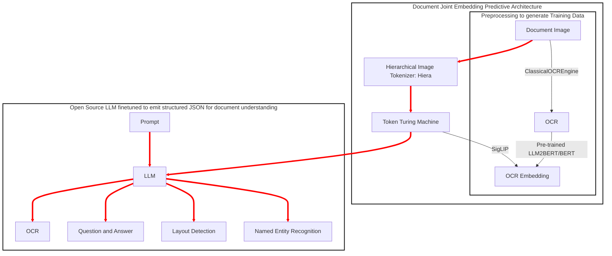
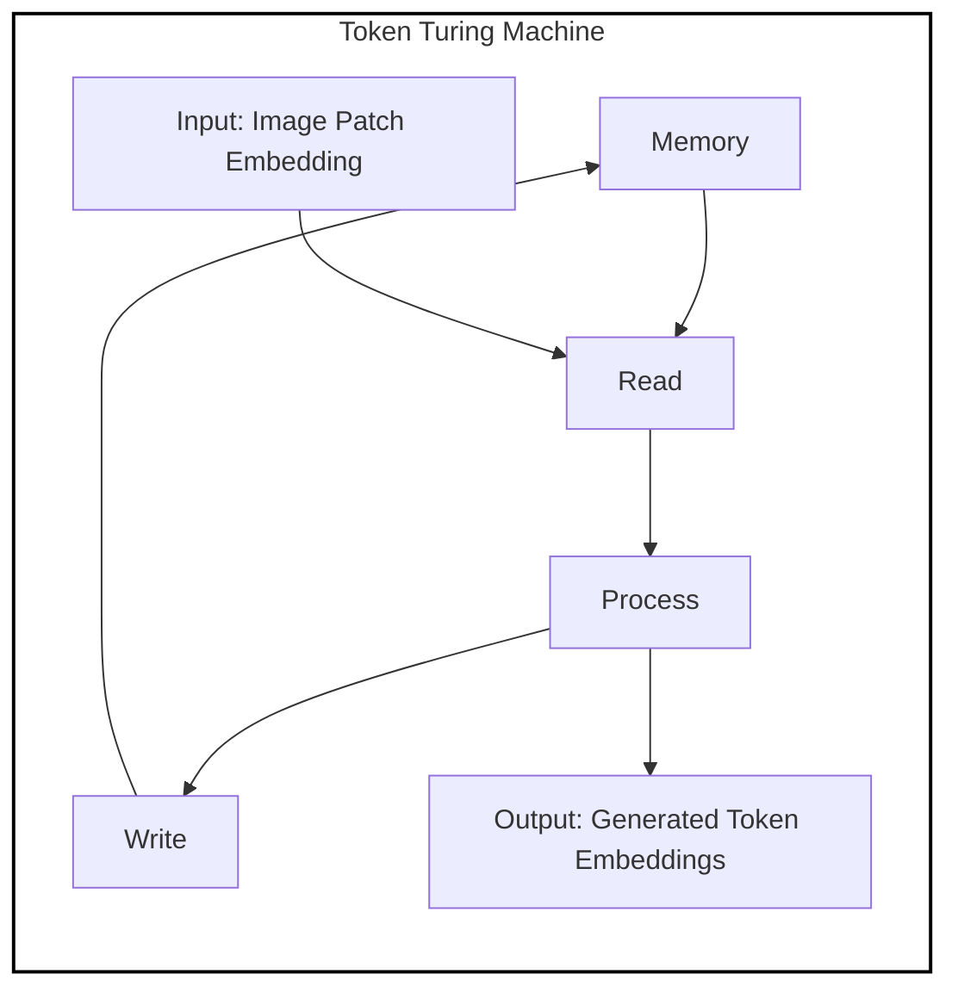

# Document Representation Learning

## 1. **Introduction**

**Problem Statement and Motivation:**

- Current Vision-Language models have shown promising results but still have limitations when applied to document understanding tasks. For instance, state-of-the-art models achieve a TexVQA score of 74.9, indicating significant room for improvement. Moreover, these models are typically trained on general vision tasks, which may not fully exploit the unique characteristics of document images. By specializing models for document understanding tasks, performance can be enhanced.
- Another critical challenge is handling multi-page documents. Existing models struggle with long sequences, making them less effective for real-world applications where documents span multiple pages. Your proposed approach leverages the Token Turing Machine to handle extended sequences, thereby addressing this limitation.
- In this section, you could briefly mention TTMs in the context of the broader discussion on handling long sequences in Vision-Language models for document understanding. You might state that TTMs offer a novel approach that overcomes the limitations of both traditional Transformers and RNN models, making them well-suited for tasks requiring sequential visual understanding over extended sequences, such as multi-page document processing.

## 2. **Related Work**

**Positioning and References:**

- Your work builds on and integrates several advanced methodologies, including the Heira backbone, Token Turing Machine, and SigLIP. The training procedure is inspired by the I-JEPA architecture, where the target text is encoded using a RoBERTa model.
- Additionally, your model is inspired by recent developments in vision-language models such as Idefics3, Idefics2, Idefics1, and LLAVA-Gemma. These models provide a foundation but do not fully address the specific challenges of document understanding, particularly in handling multi-page documents and specialized NLP tasks.
- Traditional Transformers: Discuss how traditional Transformers, despite their powerful self-attention mechanisms, struggle with quadratic complexity as sequence length increases. Highlight how TTMs address this by maintaining constant computational complexity using external memory.
- RNNs (LSTMs/GRUs): Compare TTMs with RNN models, noting how TTMs overcome the limitations of RNNs in handling long-term dependencies and sequence length scalability. Emphasize the advantages of the external memory and how it allows TTMs to better handle the integration of historical information without the vanishing gradient problem common in LSTMs/GRUs.
- Use in Document Understanding: Explain why TTMs are particularly advantageous for document understanding tasks, especially those involving multi-page documents where long-range dependencies and memory integration are crucial.

## 3. **Methodology**

**Model Architecture:**

- The architecture is designed to process document images by breaking them into overlapping patches of 224x224 pixels. These patches are then encoded using the Heira backbone, which ensures that spatial and semantic relationships are preserved. The resulting embeddings are processed through a Token Turing Machine, which sequentially generates token embeddings while maintaining the contextual flow across patches.
- The architecture is illustrated using the provided mermaid chart, showing the flow from document image to the final output.

- Architecture Overview: Explain how TTMs are incorporated into your model. Describe the process by which each image patch's encoding is processed by the TTM to generate token embeddings that efficiently integrate the document's historical information.
- Memory and Sequence Processing: Detail the external memory structure of TTMs and how it selectively reads and writes information, thus allowing the model to focus on relevant parts of the sequence without revisiting the entire document. This section should clearly articulate how this process is particularly suited for handling overlapping patches from multi-page documents.

**Training Procedure:**

- During pre-training, the token embeddings generated by the Token Turing Machine are aligned with text embeddings obtained from OCR JSON files using a pre-trained RoBERTa model. The SigLIP approach is utilized to define the similarity metric between these embeddings, optimizing the model to better understand the document's content.
- In the second stage, the image encoder is fixed, and the generated tokens are input to an LLM (Large Language Model), which is fine-tuned using the SigLIT approach to perform specific NLP tasks like NER, Q&A, Layout Detection, and OCR generation.
- Training Efficiency: Highlight how the constant computational complexity of TTMs enables efficient training on long sequences, such as multi-page documents, without the performance degradation that typically occurs with traditional Transformers or RNNs.
- Task Performance: Discuss how the memory mechanism of TTMs contributes to improved performance on tasks like OCR generation, NER, and layout detection by effectively leveraging the historical context of the document's content.

**Training Procedure Inspired by I-JEPA:**

Your model's training procedure is inspired by the Image-based Joint-Embedding Predictive Architecture (I-JEPA), adapted for the specialized task of document understanding. Here's how this inspiration translates into your model:

1. **Image Encoder (Heira Encoder):**

   - Similar to the context encoder in I-JEPA, your image encoder processes overlapping patches from document images. These patches are encoded using the Heira backbone, which extracts high-level features and semantic information from each patch. This step is crucial for capturing the document’s visual structure, including text, layout, and other elements.

2. **Predictor (Token Turing Machine):**

   - The predictor in your architecture, the Token Turing Machine (TTM), functions similarly to the predictive component in I-JEPA. The TTM processes the encoded image patches sequentially, integrating historical context through its external memory mechanism. This allows the model to predict token embeddings that are consistent with the document's overall structure and content, even across multiple pages.

3. **Target Encoder (RoBERTa Model for OCR JSON):**

   - The target encoder in your model is analogous to the target block encoder in I-JEPA. Here, the RoBERTa model processes the OCR JSON files associated with the documents, generating text embeddings that represent the document’s content. These embeddings serve as the target that the Token Turing Machine's output is compared against.

4. **Self-Supervised Learning via SigLIP:**

   - The alignment between the token embeddings from the TTM and the text embeddings from the RoBERTa model is achieved using the SigLIP method. This process is inspired by I-JEPA’s joint-embedding strategy, where the model learns to predict high-level semantic features rather than pixel-level details. By optimizing the alignment between visual and textual representations, your model can effectively learn the semantics of the document content in a self-supervised manner.

5. **Efficiency and Scalability:**
   - Just as I-JEPA demonstrates scalability and efficiency by focusing on semantic prediction rather than pixel reconstruction, your approach leverages the computational benefits of TTM’s constant complexity and the Heira encoder’s efficient feature extraction. This allows the model to handle long sequences (e.g., multi-page documents) and complex document layouts without excessive computational overhead.

**Training Procedure:**

The training procedure for your model is inspired by the SigLIP method, which utilizes a pairwise sigmoid loss for language-image pre-training. This approach is chosen for its efficiency and ability to scale well with batch size, making it particularly suitable for handling the large and complex datasets involved in document understanding tasks.

1. **Dataset Preparation:**
   - Your model is trained on a dataset consisting of document images and their corresponding OCR JSON files. These images are divided into overlapping patches, each of size 224x224, which are then processed by the Heira encoder to extract high-level features.
   - The text from the OCR JSON files is tokenized using a pre-trained RoBERTa model, which generates text embeddings representing the document's content.

2. **Model Architecture:**
   - **Image Encoder (Heira Encoder):** The image patches are passed through the Heira encoder, which serves as the visual feature extractor. The encoded patches are then fed into the Token Turing Machine (TTM), which processes the sequence of patches while maintaining contextual information through its external memory.
   - **Predictor (Token Turing Machine):** The TTM sequentially generates token embeddings from the image patches. This step is crucial for integrating visual context over potentially long sequences, such as multi-page documents.
   - **Target Encoder (RoBERTa):** The RoBERTa model processes the text extracted from the OCR JSON files, producing text embeddings that serve as the target for the predicted token embeddings.

3. **Loss Function and Optimization (SigLIP Approach):**
   - **Sigmoid Loss Implementation:** The alignment between the token embeddings generated by the TTM and the text embeddings from RoBERTa is optimized using a pairwise sigmoid loss, as proposed in the SigLIP method. This loss function focuses on individual image-text pairs, making it more scalable and efficient compared to traditional softmax-based contrastive losses.
   - **Batch Size Optimization:** Following the findings from the SigLIP research, the training process employs a batch size optimized around 32,000, balancing performance with resource efficiency. This choice ensures that the model can be trained effectively without requiring excessive computational resources.

4. **Fine-Tuning (SigLIT Approach):**
   - **Fixed Image Encoder:** During the fine-tuning stage, the Heira image encoder is fixed to preserve the learned visual representations. The TTM-generated tokens are then input into a Large Language Model (LLM), which is fine-tuned on specific document understanding tasks such as Named Entity Recognition (NER), Question Answering (Q&A), Layout Detection, and OCR generation.
   - **Resource-Efficient Training:** The SigLIP approach allows for efficient training with limited computational resources, making it feasible to fine-tune large models even in resource-constrained environments.

5. **Evaluation and Performance Metrics:**
   - The performance of the trained model is evaluated on a range of document understanding tasks using standard metrics like accuracy, F1 score, and task-specific metrics. The use of SigLIP ensures that the model maintains competitive performance even with smaller batch sizes, making it robust and adaptable to different training conditions.

## 4. **Experiments**

**Datasets and Evaluation Metrics:**

- Propose to evaluate the model on standard document understanding datasets, possibly including multi-page documents, to measure its performance across various tasks. The evaluation will involve metrics such as accuracy, F1 score, and task-specific measures (e.g., precision for NER, answer accuracy for Q&A).
- Compare the model's performance against baselines like Idefics3, LLAVA-Gemma, and other relevant state-of-the-art models to demonstrate improvements.

**Evaluation of Training Efficiency:**

- In this section, you can highlight how your training procedure, inspired by I-JEPA, contributes to the model's efficiency. Discuss the reduction in training time compared to traditional pixel-level methods and the ability to scale to larger documents and datasets. This efficiency is crucial for practical applications in document understanding where processing speed and accuracy are both essential.

**Performance on Downstream Tasks:**

- Compare your model’s performance on various document understanding tasks (NER, Q&A, Layout Detection, OCR generation) to other baseline methods. Highlight how the joint-embedding approach allows for better semantic understanding, which in turn improves task performance.

## 5. **Results and Discussion**

**Performance Analysis:**

- Analyze the results by breaking down the contribution of each component (Heira, Token Turing Machine, SigLIP) to the overall performance. Provide both quantitative metrics and qualitative insights, such as example outputs and visualizations that highlight the model's capabilities.
- Discuss any observed strengths, such as improved handling of multi-page documents or better performance on specialized NLP tasks, and acknowledge any limitations or areas for further improvement.
- Model Strengths: Reflect on the advantages brought by TTMs in terms of handling long sequences and integrating relevant historical information. Discuss how this impacts the model's ability to perform on complex document understanding tasks.
- Comparative Analysis: Compare the performance of your TTM-based approach with other models that use traditional Transformers or RNNs, emphasizing the specific improvements TTMs provide in your experimental results.
- In your conclusion, briefly reiterate how TTMs contribute to the overall success of your proposed model in document understanding tasks, particularly in handling the challenges posed by long sequences and multi-page documents.

**Advantages of the Joint-Embedding Predictive Approach:**

- Reflect on the benefits of using a joint-embedding predictive approach in your model. Emphasize how it facilitates better alignment between visual and textual information, leading to improved performance on tasks that require deep semantic understanding of document content.

**Comparison with Other Methods:**

- Discuss how your approach differs from contrastive methods and pixel reconstruction methods like MAE, focusing on the efficiency and scalability advantages as well as the reduced need for extensive fine-tuning.

- **Performance Comparison:** Highlight the advantages of using the SigLIP approach over traditional contrastive learning methods like CLIP, particularly in terms of efficiency, scalability, and performance in document understanding tasks.

- **Batch Size Impact:** Discuss how the choice of batch size, informed by the SigLIP findings, influences the overall training efficiency and resource utilization, leading to better scalability and performance of your model.

## 6. **Conclusion and Future Work**

**Summary and Implications:**

- Summarize the key contributions of the paper, emphasizing the novel approach to handling document images and the significant improvements over existing models.
- Suggest future research directions, such as exploring additional modalities (e.g., handwriting recognition), optimizing the model for specific document types, or further enhancing the handling of long sequences.
- In your conclusion, you can reiterate how the adaptation of I-JEPA’s principles to your document understanding model has led to significant advancements in handling long sequences and performing complex NLP tasks on document images.
- In your conclusion, emphasize how the integration of SigLIP and SigLIT into your training procedure enhances the model’s ability to effectively handle complex document understanding tasks while maintaining efficiency and scalability.

### Next Steps

With these sections outlined, you can start drafting each part of the paper in detail. If you need help writing specific sections, developing diagrams, or refining the text, feel free to ask!

You've provided a detailed overview of the key concepts and methodologies that inspire your training procedure, particularly the parallels between your approach and the Joint-Embedding Predictive Architecture (I-JEPA). Let's incorporate this information into the paper, specifically in the **Methodology** section, with references to how it informs your model's training strategy.
