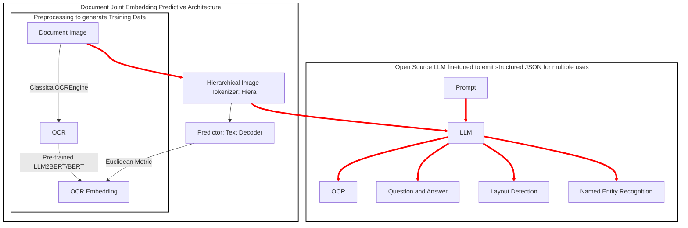

# iclr25

```mermaid
graph TD
    subgraph sg1 [Document Joint Embedding Predictive Architecture]
        style sg1 fill:none,stroke:black,stroke-width:2px;
        A[Document Image] --> B[Hierarchical Image Tokenizer: Hiera]
        subgraph sg3 [Preprocessing to generate Training Data]
            style sg3 fill:none,stroke:black,stroke-width:2px;
                A --ClassicalOCREngine--> J[OCR]
                J --Pre-trained LLM2BERT/BERT--> K[OCR Embedding]
        end
        B --> C[Predictor: Text Decoder]
        C --Euclidean Metric--> K
    end

    subgraph sg2 [Open Source LLM finetuned to emit structured JSON for multiple uses]
        style sg2 fill:none,stroke:black,stroke-width:2px;
            B --> D[LLM]
            E[Prompt] --> D
            D --> F[OCR]
            D --> G[Question and Answer]
            D --> H[Layout Detection]
            D --> I[Named Entity Recognition]
    end

    %% Highlighted paths representing inference path
    linkStyle 0 stroke:#ff0000,stroke-width:4px;
    linkStyle 5 stroke:#ff0000,stroke-width:4px;
    linkStyle 6 stroke:#ff0000,stroke-width:4px;
    linkStyle 7 stroke:#ff0000,stroke-width:4px;
    linkStyle 8 stroke:#ff0000,stroke-width:4px;
    linkStyle 9 stroke:#ff0000,stroke-width:4px;
    linkStyle 10 stroke:#ff0000,stroke-width:4px;
```
